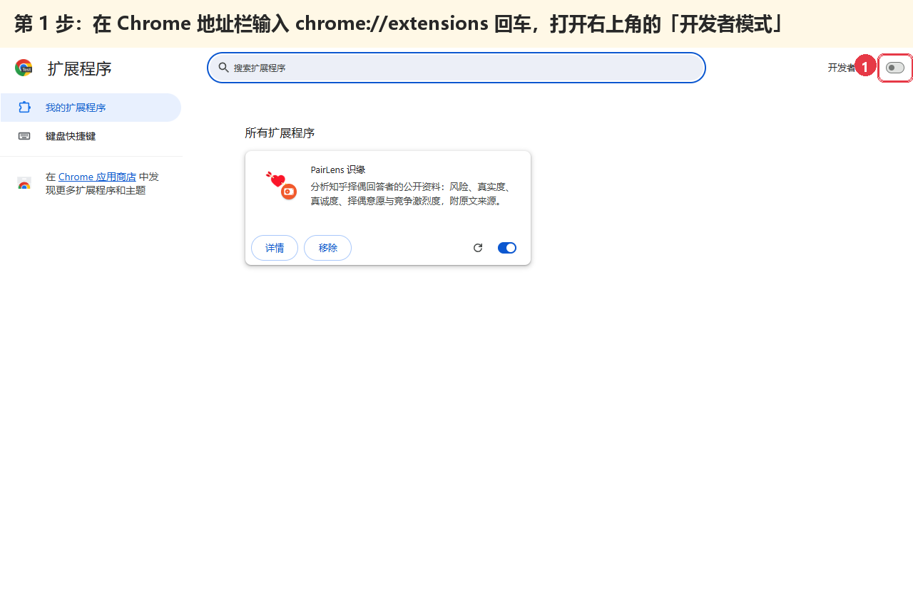
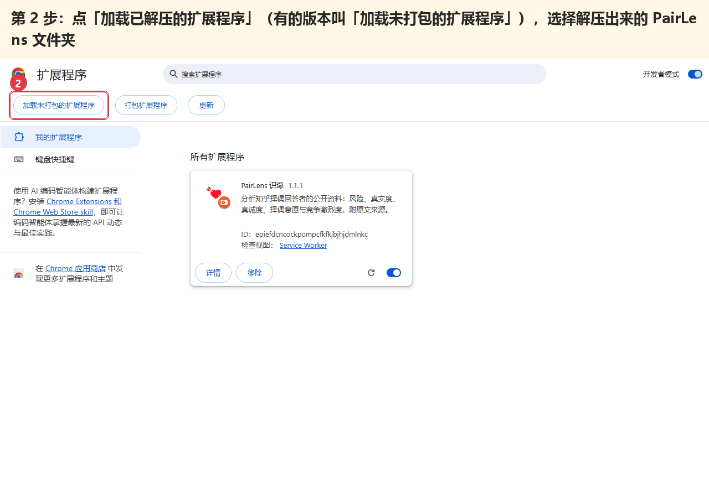
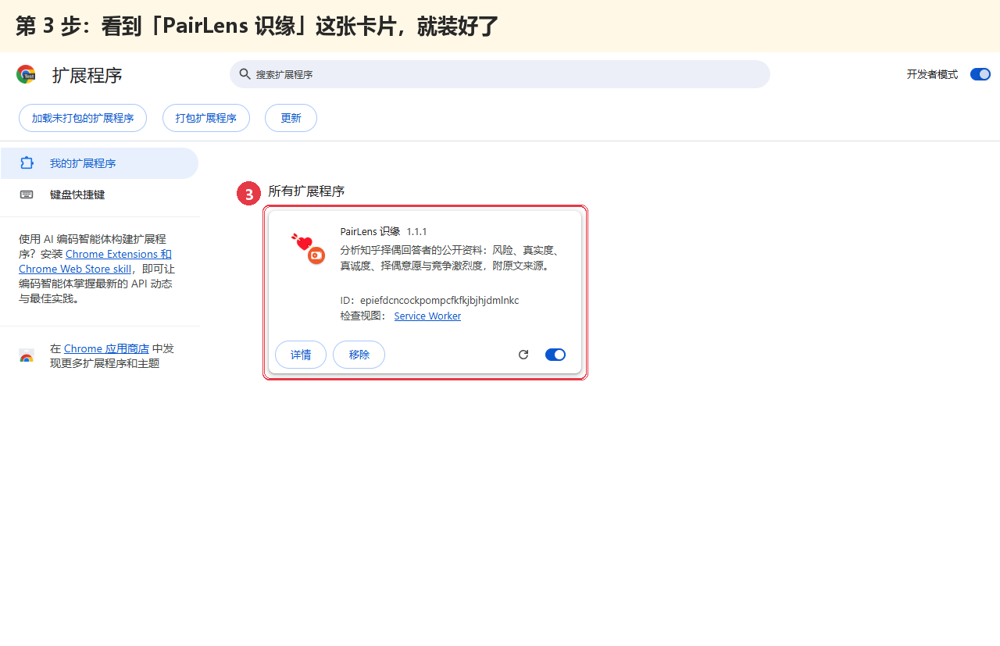
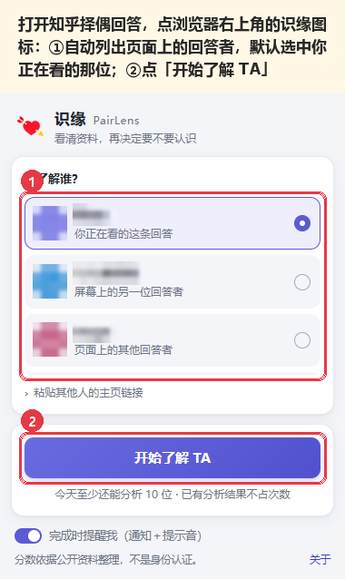
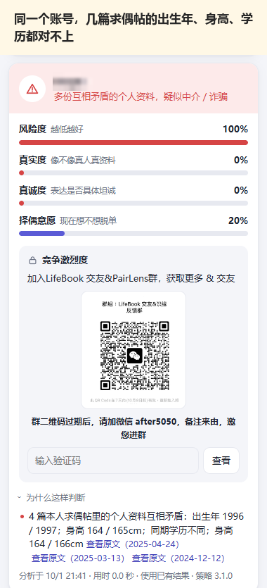
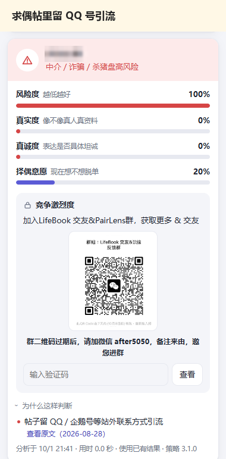
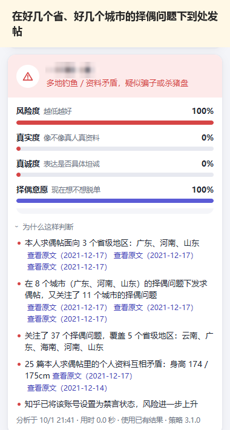
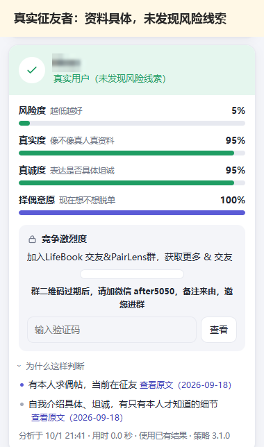

<h1 align="center">识缘 PairLens</h1>

知乎择偶问题下，冒充单身的中介、到处发帖引流的、杀猪盘都不少，光看一篇回答很难分辨。 识缘是一个浏览器插件：看到一位回答者，点一下，它帮你把 TA 公开发过的内容过一遍，告诉你哪里对不上。

点上面的绿色按钮下载，解压后按下面 3 步装好就能用。

---

## 下载后解压

下载后，在文件上点右键，选“全部解压缩”（或用压缩软件解压），得到一个 **PairLens** 文件夹。这个文件夹以后不要删，也不要挪地方，插件就装在这里。

支持电脑上的 Chrome，以及 Edge 等基于 Chromium 的新版浏览器。手机上不能用。

## 安装（3 步）

**第 1 步**：打开 Chrome，在地址栏输入 `chrome://extensions` 回车，打开右上角的 **开发者模式**。

**第 2 步**：点左上角的 **加载已解压的扩展程序**（有的浏览器写的是“加载未打包的扩展程序”），在弹出的窗口里选中刚才解压出来的 **PairLens** 文件夹（选到里面直接有 `manifest.json` 的那一层），点“选择文件夹”。

**第 3 步**：看到 **PairLens 识缘** 这张卡片，就装好了。

**建议再做一步**：点浏览器右上角的拼图图标，在识缘旁边点一下图钉，把它固定在工具栏上，以后用起来更方便。

> 用 Edge 的话：地址栏输入 `edge://extensions`，打开左边的“开发人员模式”，再点“加载解压缩的扩展”，其余一样。

## 使用

先在这个浏览器里**登录知乎**。识缘用的是你自己登录后能看到的公开内容。

**方式一：看择偶回答时直接分析。** 打开任意一个择偶问题，往下翻到你感兴趣的回答，点工具栏上的识缘图标。插件会列出页面上的回答者，默认选中你正在看的那一位；如果想看上下的其他人，点一下换过去就行。然后点 **开始了解 TA**。

**方式二：在对方的知乎主页分析。** 打开这个人的主页，点识缘图标，再点“开始了解 TA”。

分析一般十几秒，别人已经分析过的人一两秒就出结果。分析过程中你可以继续浏览，识缘不会刷新或跳转你正在看的网页。完成后插件会弹出通知提醒你。

想同时了解几个人，可以依次点“加入分析队列”，最多 5 位，按先后顺序一个个来，可以调整顺序或移出。

想保存或分享结果，点右下角“关于”左边的 **保存为图片**，可以选择直接保存，或者隐藏对方用户名后再保存。群二维码那块可以点右边的小箭头折叠，折叠后保存的图片里也不带二维码。

## 结果怎么看

| 项目 | 意思 |
| --- | --- |
| 风险度 | 公开资料里有没有不一致或可疑的地方，越低越好 |
| 真实度 | 资料像不像一个真实的人 |
| 真诚度 | 自我介绍是不是具体、坦诚 |
| 择偶意愿 | 现在是不是在找对象 |
| 竞争激烈度 | 关注 TA 的人多不多，需要群验证码才能查看 |

每一项下面的“为什么这样判断”写了依据，并附原文链接。比如对方后来的内容显示已经结婚或有了伴侣，也会在这里写出来。

有的择偶回答只有图片，没有文字，识缘暂时读不了图片内容，会单独提示。

结果只作为参考，帮你决定要不要进一步认识，不是身份认证。

## 交流群

加入 **LifeBook 交友 & 识缘反馈群**，交流使用问题、反馈误判，也可以认识新朋友。

群二维码过期或群满时，请加微信 **after5050**，备注来由，邀您进群。

---

## 详细介绍：它能看出什么

下面都是真实分析结果（为保护隐私，昵称和头像已打码）。

| 同一个账号，几篇求偶帖的出生年、身高、学历都对不上 | 求偶帖里留 QQ 号引流 |
| --- | --- |
|  |  |

| 在好几个省、好几个城市的择偶问题下到处发帖 | 正常、具体的征友帖 |
| --- | --- |
|  |  |

常见的几种情况：

- **同一个人，资料前后对不上**：这篇写 96 年、164cm、本科，那篇写 97 年、165cm、硕士，城市也从北京变成了上海。真人在自己的帖子里很少把出生年和身高写错。
- **留 QQ、企鹅号等站外联系方式引流**，或者昵称、签名、帖子里写着“帮发”“代发”“接投稿”，发的其实是别人的资料。
- **到处发**：同一篇帖子贴到好几个城市的问题下，或者在多个省份的择偶问题下发帖、关注一大堆不同城市的择偶问题。
- **照搬别人的帖子**：征友帖和别人更早发的帖子大段重合。
- **账号被知乎禁言、封禁或注销**，同时又有大量求偶内容。
- 真诚的征友者也能看出来：资料具体，前后一致，有自己的生活细节。结果里会写“真实用户（未发现风险线索）”。

识缘只看公开资料，每一条判断后面都有“查看原文”链接，可以点开自己再看一遍。

## 常见问题

**要花钱吗？** 不用。每天至少可以分析 10 位，北京时间早上 8 点重置；已有分析结果的人不占次数。

**会不会动我的知乎账号？** 不会。识缘只在你点击开始后查看对方公开的内容，不点赞、不关注、不发消息，也不读取你的知乎账号信息。

**提示“知乎暂时限制了请求频率”怎么办？** 等几分钟再试。识缘会自动放慢速度。

**插件更新了怎么办？** 重新下载 PairLens.zip，解压覆盖原来的 PairLens 文件夹，再到 `chrome://extensions` 页面点识缘卡片上的刷新按钮。

**卡片上显示“错误”或者装不上？** 一般是选错了文件夹，要选到里面直接有 `manifest.json` 的那一层。

## 源码

插件的全部代码在 [source](source) 文件夹，和 PairLens.zip 里的文件一样，可以自己查看：插件只在你点击开始后读取对方公开的知乎资料，没有其他网络请求目标（除了识缘自己的服务器 yourlifebook.app）。

## 隐私

识缘只在你点击开始后查看对方公开的知乎内容，不读取你的知乎账号信息。为了下次更快给出结果，分析结果会保存在识缘服务端。请尊重被了解的人，不要传播分析结果。
